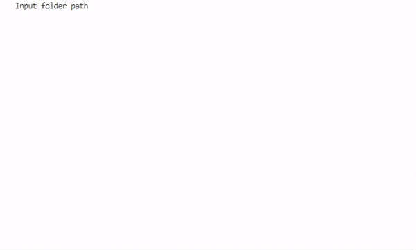

# FoldersTranslator
Translate subfolders and files of input folder path using Google translate.
___
## Default process
1. Input folder path.
2. Input destination language abbreviation.
3. Input the way you want to see the translation in renamed files:
    rename: translation only
    prefix: translation [original text]
    suffix: original text [translation]
4. Check the way paths will look like.
5. Confirm creating new folder with translation.
6. If succeed, new folder with translated paths will be created and shown the result tree.

___

___

Tested with Python 3.10